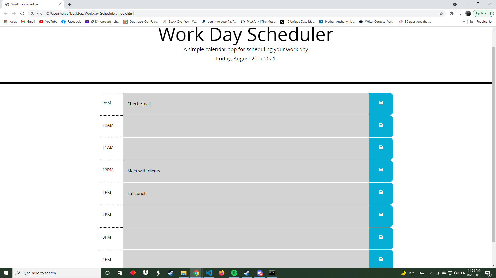

# Workday Scheduler

### This is the repo for a Workday Scheduler app I created to help people keep track of tasks they need to complete throughout the 9-5 workday. I built it as part of the Univeristy of Central Florida Bootcamp to hone my coding skills.

## Technologies Used
### HTML5, CSS, Bootstrap, Javascript, jQuery

## Setup
### Can be run in a web browser from here: https://pegasoos.github.io/Workday-Scheduler/